# Data Model (Current)

This project currently uses an in-memory data model (no database schema yet), defined mainly in [src/background-data.ts](../src/background-data.ts).

## Entity Relationship Diagram (ERD)

## Notes

- `month`, `location`, `durationInMonths`, `isCurrent`, and `projects` are optional in `CAREER_MILESTONE`.
- `EXTERNAL_LINK` is modeled from `UserInfo.urls: string[]`.
- `PROJECT` is modeled from `CareerMilestone.projects?: Project[]`.
- Relationships are conceptual (application-level), since there is no persisted relational database yet.
