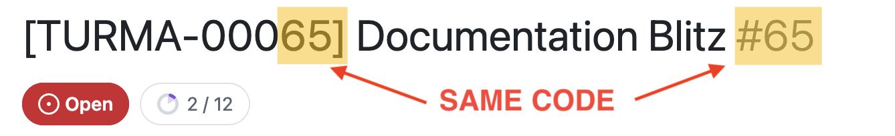
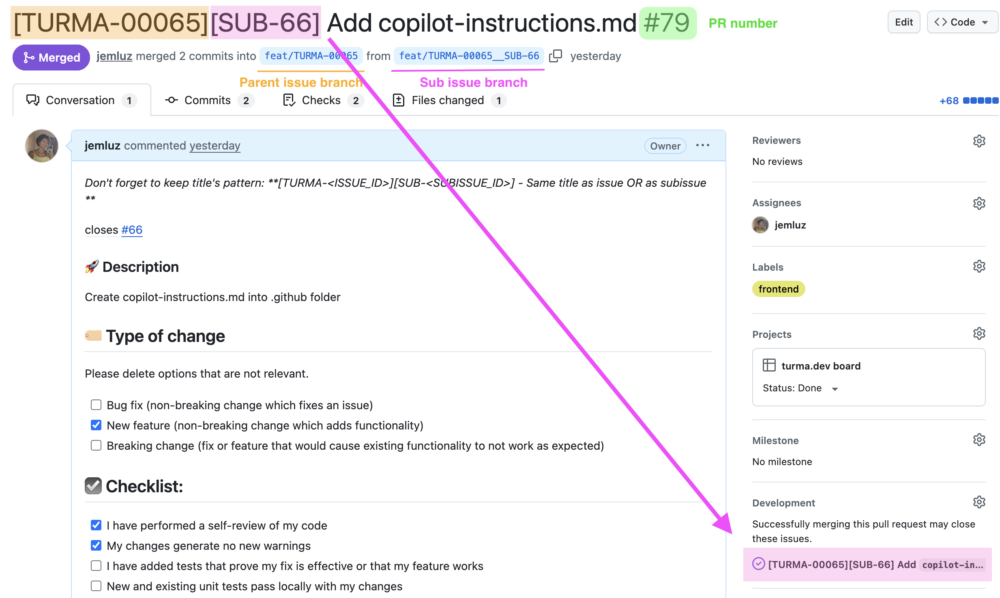

# Dev Workflow

This document describes the development workflow for the project, including naming conventions, versioning, and continuous integration patterns. The goal is to ensure continuous delivery of small, well-tracked, and organized changes.

## 🛠️ Setup

For details on how to set up the project, see [Project Setup](./project-setup.md).

## 🎨 Code Formatting

- There is an `.editorconfig` file to set what is expected as code formatting standards
- ESLint is configured to check code quality and style issues. Use `npm run lint` to check for issues
- Prettier was installed here so you can use the scripts `npm run lint:check` and `npm run lint:fix` to solve formatting issues

## ✅ Task tracking and continuous delivery

The main goal with this workflow is to deliver small and continuous changes, so if an issue is getting a large scope, sub-issues must be created to keep the delivery process small and continuous.

Also, it is important to be able to track any [pull requests - commit - branch - sub-issue - issue - milestone - release] relations. To allow that, follow the patterns below.

### 🚀 Release

A release is a functional version with new features/fixes, usually nesting one or more milestones inside itself.

### 🎯 Milestone

A milestone is a package of one or more related issues that usually define important achievements for the project.

### 📌 (Main/Parent) Issues

An issue is a key point to be done within a milestone. It could have sub-issues or not.
Every issue starts by creating a new branch from the dev branch, and when done, ends with a Pull Request from that issue branch pointing back to dev branch.
The PR merge type must be squash.

**Creating/naming an issue**

1. Before starting any work, you should create an issue, which will generate the issue number.
2. Set the issue title correctly, using the pattern `[TURMA-XXXXX] + issue_title`. The generated issue number (#X...) should fill the `XXXXX` part.

- As example: if the issue is `#86` the code will be `[TURMA-00086]`
- As another: if is `#3` the code will be `[TURMA-00003]`

**Creating/naming a (main/parent) issue branch:**

3. Follow the pattern `feat/TURMA-XXXXX` to create branches based on the issue that was opened

**Commits at (main/parent) issue branches:**

4. Commits in the issue branch should follow the [Semantic Commit Messages](https://gist.github.com/joshbuchea/6f47e86d2510bce28f8e7f42ae84c716) pattern.

- Use this format directly: `type(IXXXXX): commit message description whatever`
- Or if there is a PR from some sub-issue, set the squash merge title to `[TURMA-XXXXX] + [SUB-YY] + title (PR #ZZ)` (#ZZ is PR number)
- See more details in the PRs section

### 📍 Sub-issues

**Creating/naming a sub-issue**

5. If the issue is too big, you should create sub-issues to divide the work into small parts. Each sub-issue will generate its own number too.
6. Set the sub-issue title correctly, using the pattern `[TURMA-XXXXX] + [SUB-YY] + title`. The generated sub-issue number (#Y...) should fill the `YY` part.

- As example: if the issue is `#86` and sub-issue is `#89`, the code will be `[TURMA-00086][SUB-89]`
- As another: if the issue is `#3` and sub-issue is `#4`, the code will be `[TURMA-00003][SUB-4]`

**Creating/naming a sub-issue branch:**

7. Follow the pattern `feat/TURMA-XXXXX__SUB-YY` to create branches based on the sub-issue that was opened

**Commits at sub-issue branches:**

8. Commits in the sub-issue branch should follow the [Semantic Commit Messages](https://gist.github.com/joshbuchea/6f47e86d2510bce28f8e7f42ae84c716) pattern.

- Use this format: `type(IXXXXX_SYY): commit message description` without zeros to fill.
- Example: `feat(I65_S71): add icons to documentation headings`
- When the sub-issue is completed, the PR will be merged into the parent issue branch

### 🔀 Pull Request (PR)

Every PR marks the end of an issue or sub-issue.
The PR should be referenced in its corresponding issue/sub-issue.

**Which branch to point:**

- Issue branches should point to the dev branch.
- Sub-issue branches should point to their parent issue branch.

**PR merge type:**

All PRs should use the squash merge type. Avoid other types.

**PR merge commit title and description:**

- IF is a PR `from issue` branch `to dev branch`:
  - The title must be: `[TURMA-XXXXX] + title (PR #ZZ)` (#ZZ is PR number)
  - The description should start with `more details at #XX`, followed by previous branch's commit messages (no need to edit)

- IF is a PR `from sub-issue` branch `to parent issue` branch:
  - The title must be: `[TURMA-XXXXX][SUB-YY] + title (PR #ZZ)` (#ZZ is PR number)
  - The description should start with `more details at #XX`, followed by previous branch's commit messages (no need to edit)

### 📋 Summary

| Type           | Title                           | Branch Naming              | Commit Format                      |
| -------------- | ------------------------------- | -------------------------- | ---------------------------------- |
| **Issues**     | `[TURMA-XXXXX] + title`         | `feat/TURMA-XXXXX`         | `type(IXXXXX): commit message`     |
| **Sub-issues** | `[TURMA-XXXXX][SUB-YY] + title` | `feat/TURMA-XXXXX__SUB-YY` | `type(IXXXXX_SYY): commit message` |
